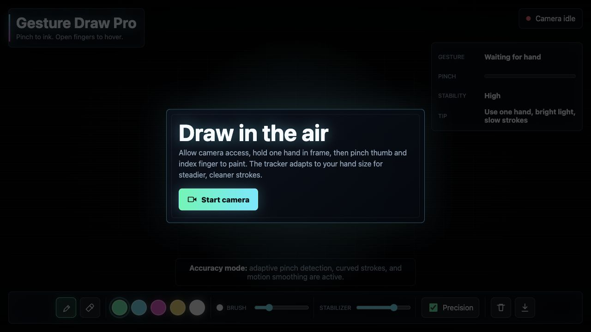
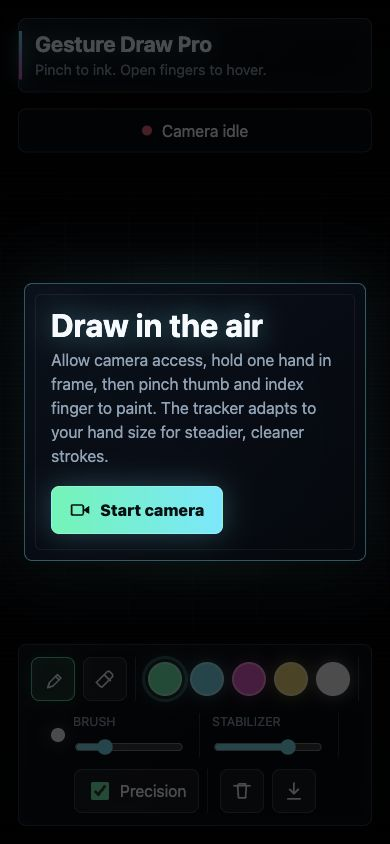

# Hand Gesture Drawing App


A futuristic webcam drawing app that lets users paint in the air with hand gestures. It tracks the hand directly in the browser, turns a thumb-index pinch into brush input, and keeps the camera feed local to the device.

## Preview

### Desktop



### Mobile

<p align="center">
  
</p>

## Overview

Gesture Draw Pro is built as a browser-based creative tool. The app detects a single hand through the webcam, maps the index finger position to the canvas, and uses a pinch gesture to decide when ink should touch the screen. The interface is designed like a futuristic HUD so the user can see camera status, pinch strength, stabilizer level, and active drawing mode while using the app.

## Features

- Draw by pinching your thumb and index finger
- Hover by opening your fingers
- Adaptive pinch detection based on hand size
- Motion smoothing with a stabilizer slider
- Precision mode for tighter gesture control
- Pen and eraser modes
- Neon color palette
- Brush size control
- Clear canvas action
- Download drawing as a PNG
- Responsive HUD-style interface

## Controls

| Control | Purpose |
| --- | --- |
| Pinch gesture | Starts drawing or erasing |
| Open hand | Moves the pointer without drawing |
| Pen | Draws neon strokes |
| Eraser | Removes parts of the drawing |
| Color swatches | Changes brush color |
| Brush slider | Adjusts stroke thickness |
| Stabilizer slider | Smooths hand movement |
| Precision mode | Makes pinch detection tighter |
| Clear | Resets the canvas |
| Download | Saves the artwork as an image |

## How It Works

1. The browser opens the webcam after the user gives permission.
2. MediaPipe detects hand landmarks from the video frame.
3. The app tracks the index finger as the drawing pointer.
4. Thumb-to-index distance is normalized by hand size for better accuracy.
5. Pinch strength controls whether the app draws, erases, or hovers.
6. Motion smoothing reduces jitter before strokes are rendered on canvas.

## Tech Stack

- HTML
- CSS
- JavaScript
- MediaPipe Tasks Vision

## How To Run

Open the project with a local server:

```bash
python3 -m http.server 5173
```

Then visit:

```text
http://localhost:5173
```

Allow camera access when the browser asks for permission.

## Requirements

- A webcam
- A modern desktop or mobile browser
- Camera permission enabled for the local site
- An internet connection for loading the MediaPipe runtime

## How To Use

1. Click **Start camera**.
2. Keep one hand visible in the webcam frame.
3. Pinch your thumb and index finger to draw.
4. Open your fingers to move without drawing.
5. Use the toolbar to change color, brush size, stabilizer, mode, and export.

## Accuracy Tips

- Use bright lighting.
- Keep your hand fully inside the camera frame.
- Draw slowly for clean lines.
- Increase stabilizer for smoother strokes.
- Turn off precision mode if pinch detection feels too strict.

## Troubleshooting

- If the camera does not start, confirm the browser has camera permission.
- If the preview is blank, refresh the page after allowing camera access.
- If tracking feels jumpy, improve lighting and increase the stabilizer value.
- If drawing starts too easily, keep precision mode enabled.

## Browser Support

Use a modern Chromium-based browser for the best camera and WebAssembly performance.

Safari and mobile browsers may require HTTPS or localhost before camera permission is available.

## Screenshots

The screenshots in this README are captured from the app's preview state so the UI, drawing canvas, and gesture HUD are visible without requiring camera permissions.

## Project Structure

```text
.
├── assets/
│   └── screenshots/
├── DEVELOPMENT.md
├── index.html
├── styles.css
├── app.js
└── README.md
```

See [DEVELOPMENT.md](DEVELOPMENT.md) for local maintenance notes and manual checks.

## Privacy

The app runs hand tracking in the browser. It does not upload the webcam feed to a custom backend.

MediaPipe scripts and model files are loaded from public CDNs, but camera frames are processed locally in the browser session.
